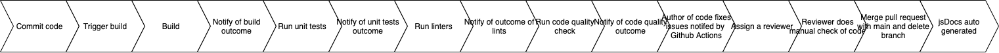

Our pipeline begins when a certain someone who thinks their cool in the team is writing changes to their code and thinks that they are done, so they want to do a pull request to the main branch. However, they are not done.

Before a pull request is created, the someone can locally lint their code with scripts that we have created for linting. These scripts are run locally and fix the linting errors with can be auto-corrected as well as alert the someone of their other linting errors that can not be auto-corrected. This has helped to solve a majority of our linting issues. 

Additionally, the someone can modify the deployment link in the tests scripts to run locally just to test that their changes do not break the functionality of the site. The deployment link in the tests currently is the deployment link from main. Currently we have some simple end to end tests. One of our end to end tests checks that the home page loads correctly, attempts to favorite a recipe, and then checks that the favorited recipe is now populated on the homepage and the favorites page. The other end to end test we have checks that the search page loads correctly on a blank input query and that the next and previous buttons work. In the future, we are planning to check that the search bar works from every page, that recipes can be favorited and unfavorited from every page, that the recipe results remain the same when pressing the forward and back buttons on the search page, that adding recipes to custom favorites list functions correctly, and many other components of our site having to do with the favorites functionality. We will come up with more test cases as the development of extended features of our application progresses.

After the pull request is created, first the project will build. When the build is complete the certain someone will be alerted of the results of their build.
If the build is not successful, that someone will have some major issues to correct in order for the code to successfully build.

If the build is successful, then that certain someone is excited and the real fun now begins. The workflow will continue on to the linting process. 

After the linters runs and checks for style, the results will notify that special someone. For linting we used ESLint and prettier because they seemed
reputable linters which already had frameworks in place to work with github actions.

After the linting, the next stage in our workflow is the code quality checker. For our code quality checker, we considered many great options such as:
codeclimate, codacy, and many others, but all those seemed to only have paid options and we are broke college students. We went with the cheap, but effective
and possibly superior **CODEFACTOR.io.** Codefactor.io is it's own application, so it doesn't have a yml file; however, it will always run in our pipeline
when that special, certain someone decides to make a pull request to main. Codefactor will role play as a professor and assign the special someone's code
a grade and it will list specific issues to fix so **that** certain someone can improve the grade and quality of their code. _C's don't get degrees in our repo._

After all the automated workflows have run, that certain someone might face some disappointing news and will have to fix their code, essentially putting them back
at the beginning stage of our pipeline.

However, on the off chance that their code is somehow perfect, the next step of our pipeline would to be assigned a different more special someone as their reviewer.

Additionally, our deployment on Netlify will create a preview link for the PR. The someone and the reviewer should check that the preview site works correctly, by locally running the end to end tests on the preview site. 

After the code has successfully merged to main, JsDocs will auto generate documentations to a separate repo titled group22xjsdocs which is published to a
github pages at https://demyinn00.github.io/group22xjsdocs/

The deployed site (on Netlify) will also be updated with the merged changes.

The next step in our pipeline is for the end to end tests workflow to run against the updated deployed site. Like we stated earlier, the end to end tests are linked to the site that is deployment from main. Thus, the someone pushing their code can manually change the link to run the tests locally, but that end to end tests will be run on the newly deployed site from main after merging. Because the expectation is that the someone will run the tests locally first, we do not anticipate the deployed link failing the end to end tests at this stage. 

This concludes our superior pipeline :)

Here is a diagram of our pipeline below:

