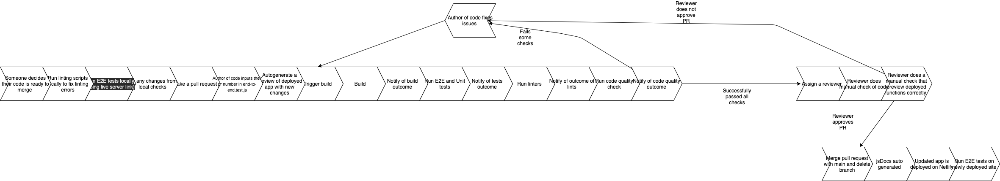

Our pipeline begins when a certain someone who thinks their cool in the team is writing changes to their code and thinks that they are done, so they want to do a pull
request to the main branch. However, they are not done. 

After the pull request is created, first the project will build. When the build is complete the certain someone will be alerted of the results of their build. 
If the build is not successful, that someone will have some major issues to correct in order for the code to successfully build.

If the build is successful, then that certain someone is excited and the real fun now begins. 
The next step in our pipeline is for the unit tests workflow to run against their code. For the unit test framework, we decided to use Jest because we used it in
our lab 8 and thought that it would be fairly simple to implement and it served our testing purposes. 

Currently we do not have any unit tests, but that will change as soon as early as next week. Week of 11/15.
Right now, we need the code for the different features to be complete or at least prepared, so that we can write unit tests for those functions. Additionally, 
we need the minimum viable product to be functional to write the end-to-end tests.

Assuming that we completed the unit tests, the workflow will notify that someone of the results of the unit tests. The workflow will continue on to the linting 
process. 

After the linters runs and checks for style, the results will notify that special someone. For linting we used ESLint and prettier because they seemed
reputable linters which already had frameworks in place to work with github actions. 

After the linting, the next stage in our workflow is the code quality checker. For our code quality checker, we considered many great options such as:
codeclimate, codacy, and many others, but all those seemed to only have paid options and we are broke college students. We went with the cheap, but effective 
and possibly superior **CODEFACTOR.io.** Codefactor.io is it's own application, so it doesn't have a yml file; however, it will always run in our pipeline
when that special, certain someone decides to make a pull request to main. Codefactor will role play as a professor and assign the special someone's code 
a grade and it will list specific issues to fix so **that** certain someone can improve the grade and quality of their code. *C's don't get degrees in our repo.*

After all the automated workflows have run, that certain someone might face some disappointing news and will have to fix their code, essentially putting them back
at the beginning stage of our pipeline. 

However, on the off chance that their code is somehow perfect, the next step of our pipeline would to be assigned a different more special someone as their reviewer.
Our future plan is to automate the reviewer assignment process, so that reviewers of pull request is evenly distributed amongst the team. After the reviewer reviews
the someone's code, the reviewer can make suggestions to their code for improvements or merge their code if deemed worthy, but the reviewer will notify the certain 
someone either way. 

Finally, after the code has successfully merged to main, JsDocs will auto generate documentations to a separate repo titled group22xjsdocs which is published to a 
github pages at https://demyinn00.github.io/group22xjsdocs/

This concludes our superior pipeline :)

Here is a diagram of our pipeline below:

