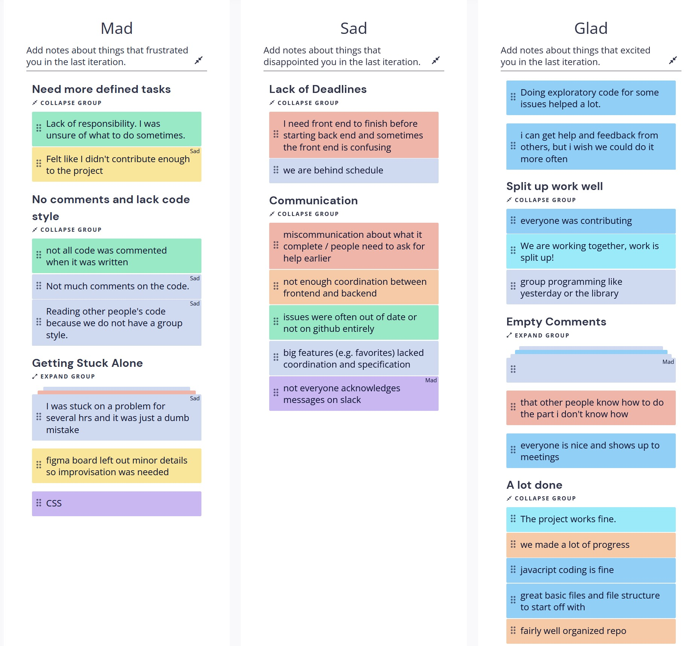
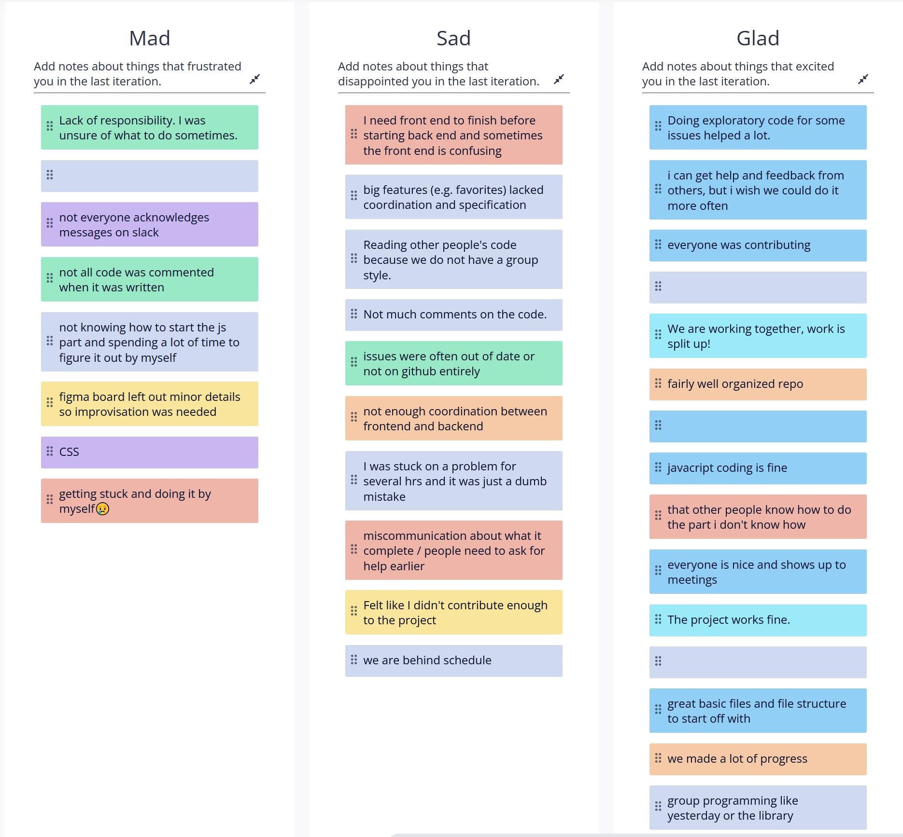
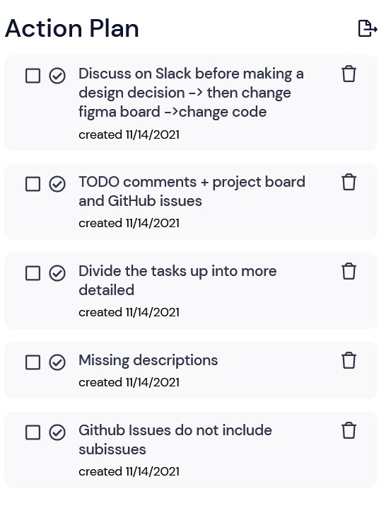
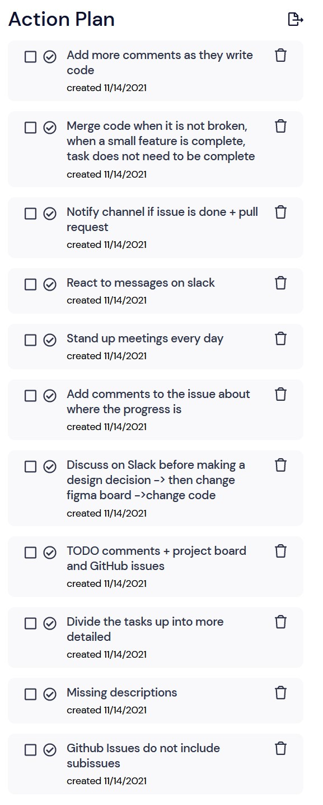

# Team 22x Group 22 Meeting Notes

## Meeting Type: Sprint Retrospective

## Date: 11-14-2021

## Location/Time of Meeting: ZOOM 3:45 P.M. - 5 P.M.

### Attendance

- Emily Ekaireb
- Fangqi Yuan
- Samantha Lin
- Mitchell Herbert
- Dennis Zhao
- Joey Dang
- Justin Lee
- Elliot Chung
- Egor Pustovalov

### Not in Attendance

- David Em-Yinn

# What we have done right:

- Spliting up the work pretty well
- chossing the task is a good practice, everyone knows what they are donig.
- We can also reach out to people who are chooisng a task

# what needs to be improved for the next sprint

## getting help

- sometimes it is easy to get stuck by oneself, therefore, we should be more willing to help each other.

## need more defined tasks (improve on this)

    - github isseus cant not up to date address on sub-issues
    - issues do not have exactly what to do
    - make TODO comments as u go and github issues and project board
    - divide tasks up into mroe detailed
    - talk about on slack then change on firgam board and then code.

## improve communication

    - slack communication
    - not clear what is actually done
    - addd comments to the issue
    - do the stand up meeting even if there is nothing that is actually done.
    - react to messeges.

## lack of deadlines

    - @ channel when something is done
    - merge even it is not all the way done
    - merge little section one by one

## comments

    - add more comments

### Retrium branstorming

### Action Plan

