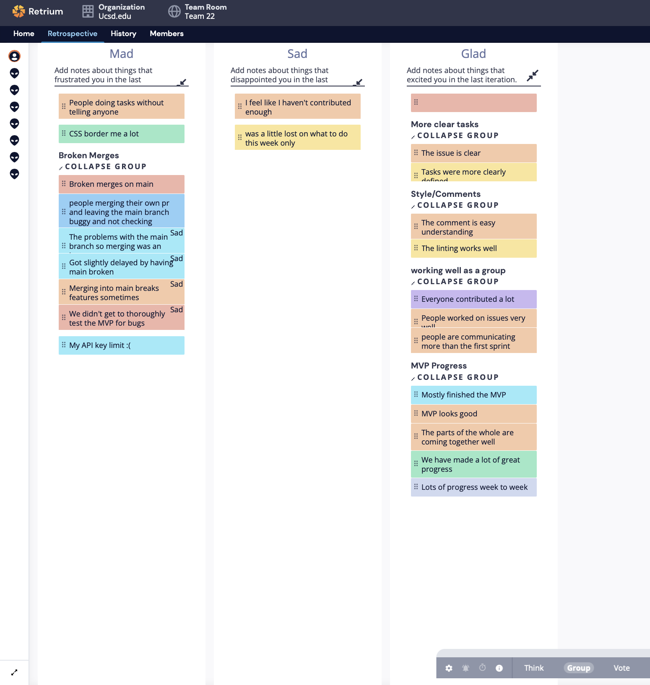
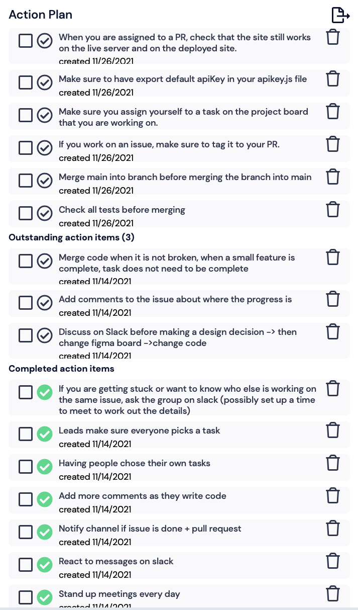

# Team 22x Group 22 Meeting Notes

## Meeting Type: Sprint Retrospective 2

## Date: 11-26-2021

## Location/Time of Meeting: ZOOM 3:10 P.M. - 3:55 P.M.

### Attendance

- Emily Ekaireb
- Fangqi Yuan
- Samantha Lin
- Mitchell Herbert
- David Em-Yinn
- Justin Lee
- Elliot Chung
- Egor Pustovalov

### Not in Attendance

- Dennis Zhao
- Joey Dang

# What we have done right:

- Everyone working well as a group
- Communicating and responding(reacting) on Slack

# What needs to be improved for the next sprint

## Broken merges

- Sometimes we merge a pull request and it breaks the code in main
- We should merge main into the branch before merging the branch into main
- Checking deployment link and live server when doing a pull request
- Follow our PR procedures

## Tag issues to pull request

- Make sure to assign yourself to an issue and tag the pull request so people don't write duplicate code

## Api Key

- Use the api key from our Slack channel in General

## Contribution

- If you don't think you're contributing enough, assign yourself a task/issue in Github

### Retrium branstorming

### Action Plan

