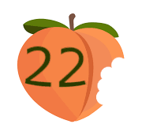

# Team Name: Team22x Plus Pro Max

## brand: 

## Where does the name comes from? 
One of the team lead is an apple fanboy. \
Therefore, he put all the suffixs from an iphone to buff this team. \
We ambitiously strive to make our software product deliver as good user experience as an iphone. 

## Roster: 
- Emily Ekaireb, https://github.com/eekaireb, \
I am a third year Computer Engineering major from Muir. I am a San Diego native so I love going to the beach, maybe a little too much . Some of my hobbies include:

    - Swimming
    - Surfing
    - Hiking
    - Knitting
    - And playing with my dogs
 
- Elliot Chung, https://github.com/ec-2018, \
    Hey everyone, my name is Elliot Chung. I’m a CS student from San Diego studying at UCSD. My hobbies include rock climbing, building keyboards and computers, and video games. I started learning Java when I was 12 years old in school. Using that, I competed on a robotics team for 3 years where I got to learn control systems and hardware programming. Currently I’m interested in machine learning and I’ve begun learning tensoflow to start exploring ML. 

- David Em-Yinn https://demyinn00.github.io/lab2_site/ \
    I’m a 4th year CS student. I like to play guitar and hang out with friends. Ps… my GitHub pages needs more work. This is just the prototype 

    favorite shows
    1. FMABH
    2. AOT
    3. ATLA

- Justin Lee https://github.com/Justinian074/ \
    I’m a third year at UCSD. Other things about me is that I was born in South Korea, but I moved to the United States when I was 1. Some hobbies that I enjoy doing are

    > Playing video games, reading manga, and eating sweets.  

    My programming experience goes all the way back to freshmen year in high school. My site from high school is still up at [this link](http://justl2.gitastudent.online/).

- Egor Pustovalov https://github.com/EgorDP/ \
    Hello, I am an aspiring software engineeer who enjoys embedded systems, datastructures, and other computer science pathways. As Steve Jobs put it 
    > Be a yardstick of quality

    Favorite Hobbies \
    1. Reading
    2. Piano
    3. Hiking

- Hongxin(Dennis) Zhao https://github.com/DanlandYZ/ \
    My name is Dennis, senior computer science student at UCSD. I am really interested in computers, I had my first computer when I was 10, built 2 PCs along the way. Therefore, there is no doubt that computer science becomes my major.\
    Hobby: 
    1.  Photography
    2. working out
    3. Gaming 
    4. Read Novels

    Photography is my favorite activity, I enjoy pressing the shutter to capture that moment. When I look back at those photos, it reminds me of my past. However, I only know how to shoot with cameras, not with smartphones. 

    My favorite book is Albert Camus's _Stranger_. It explains _Absurdism_ with a story which I believe it is a great idea. 

- Joey Dang https://github.com/dangjoey/ \
    Hey y'all! I'm a third year math-cs major and I'm from San Francisco. I love dogs and drinking jasmine milk tea. I really like traveling to big cities, hiking mountains, eating different types of food, and portrait photography!

- Samantha Lin https://github.com/samanthaylin3/ \
    I'm a student at **UCSD** majoring in ***Mathematics-Computer Science*** and minoring in _Business_ and _Accounting_.
    My favorite programming language is  ~~C++~~ _Python_! 
    A Git command I always forget that comes before `git commit` is `git add`.\
    I love [Google](https://google.com) because this is where I learn everything and is where I go to when I'm stuck on programming.\
    One of my favorite places in the US is the ***Rocky Mountains*** because I got to see a moose [The Rocky Mountains with a moose in the water](./images/rockymtmoose.PNG). _I wish I could sit here all day and code._

- Mitchell Herbert https://github.com/mtherber/ \
    I'm a third year computer engineering student at UCSD with fluency in Python, C++, and Java. When I'm not doing classwork, I'm learning new recipes, boogie boarding, or running my business. I enjoy tinkering with electronics and playing classic games like Super Mario Galaxy. 

    I run a small electronics business called [Whizoo Electronics](https://www.whizoo.com). I manufacture and sell solder reflow oven controllers and kits. Read the build guide [here](https://www.whizoo.com/reflowoven).

- Fangqi Yuna https://github.com/HairforceNiko/ \
    Hello, my name is **Fangqi Yuan** and I'm currently a senior student in **UC San Diego**.\
    I have complete several internship during past two years in ICBC(**Industrial and Commercial Bank of China**) and (**Shanghai Shiyou Company**). \

    I'm good at writing Java and SQL code and debug existing programs.

    I love what Bill Gates say:
    > Life is not fair; get used to it.

    I love playing video games especially FPS(First-person Shooter). I used to achieve top500 in Overwatch for five seasons and got diamond in Tom Clancy's Rainbow Six Siege.

    I also love watching japanese anime movies such as Takanashi Rikka.

## Internal Documentation

